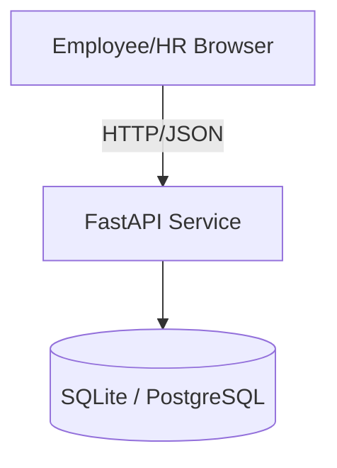
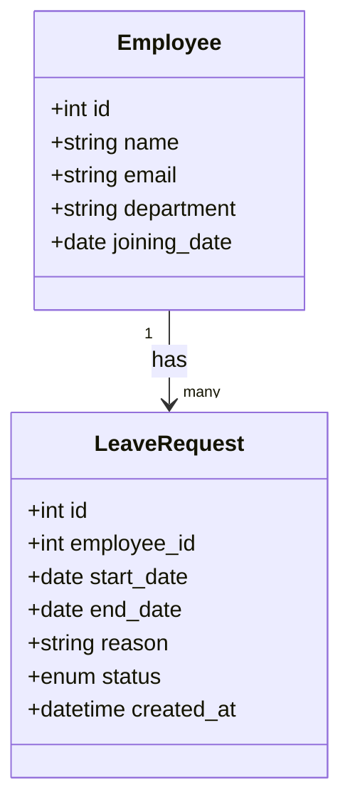
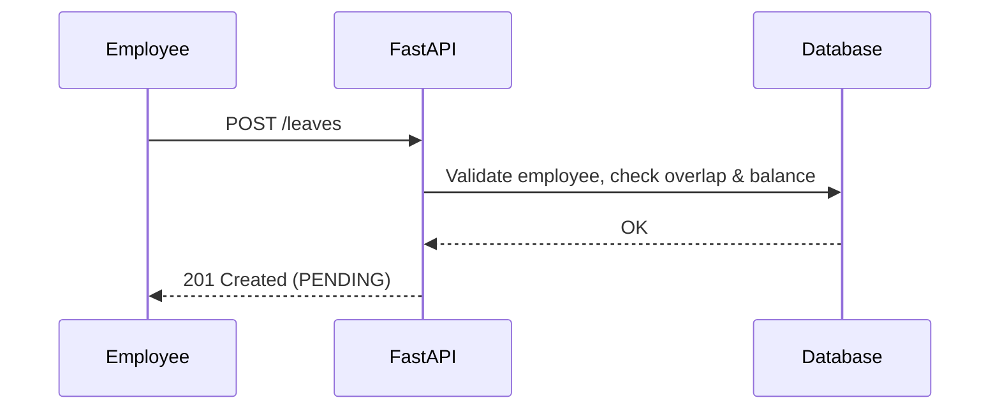

# High Level Design (HLD)

## Architecture (MVP)

## Logical Data Model

## Sequence: Apply Leave

## Scaling Notes (50 -> 500 employees)
- Move to PostgreSQL with proper indexes: `employee.email`, `leave_requests(employee_id, status, start_date)`
- Add caching for frequent balance reads (e.g., Redis) if needed.
- Containerize (Docker), run behind a reverse proxy.
- Background jobs for reports/notifications.